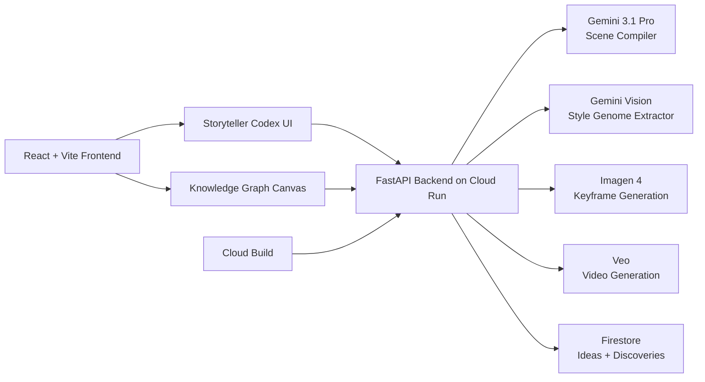

# Vortex Previz

Vortex Previz is a multimodal creative-director agent for filmmakers, ad teams, and content creators. Instead of typing one giant prompt into a chat box, users build a cinematic sequence inside a spatial graph, drop in reference frames for style extraction, and stream back an interleaved storyboard of narration, keyframes, and video.

This project is designed for the Gemini Live Agent Challenge under the Creative Storyteller category.

## Why it stands out

- Beyond text box UX: a spatial graph becomes the input surface for story generation.
- Multimodal output: the app streams voiceover, image keyframes, and optional Veo video scene-by-scene.
- Style-aware generation: uploaded frames are analyzed into reusable "style genome" nodes.
- Director feedback loop: every generated scene comes with commentary so the system explains creative intent.
- Real deployment path: the backend is packaged for Google Cloud Run and persists graph data with Firestore.

## Hackathon fit

- Category: Creative Storyteller
- Gemini usage: Gemini 3.1 Pro compiles graph intent into scene scripts and extracts style from image input.
- SDK requirement: uses the Google GenAI SDK and includes an ADK agent in `backend/agent/`.
- Google Cloud requirement: Cloud Run deployment automation via `cloudbuild.yaml`, Firestore persistence, and Vertex-compatible backend configuration.
- Bonus point support: automated deployment is included through Cloud Build plus Cloud Run.

## Core flow

1. The user assembles a sequence from graph nodes such as subject, tone, camera, lighting, and pacing.
2. The backend compiles that raw topology into a coherent shot list using Gemini.
3. Each shot is rendered into a cinematic keyframe with Imagen and optionally a Veo clip in live mode.
4. Commentary, visuals, and scene updates stream back over SSE into the Storyteller Codex.
5. The UI synchronizes the active shot with the exact nodes that influenced it.

## Architecture



## Tech stack

- Frontend: React, TypeScript, Framer Motion, Tailwind CSS
- Backend: FastAPI, Python, Server-Sent Events
- AI: Google GenAI SDK, Google ADK, Gemini 3.1 Pro, Imagen, Veo
- Cloud: Cloud Run, Cloud Build, Firestore

## Repository map

- `src/components/KnowledgeGraph.tsx`: spatial graph interaction layer
- `src/components/StorytellerCodex.tsx`: streamed multimodal playback panel
- `backend/main.py`: FastAPI API and static serving
- `backend/services/omni_orchestrator.py`: scene compilation plus image/video orchestration
- `backend/services/gemini_service.py`: Gemini and style extraction wrapper
- `backend/services/firestore_service.py`: Firestore persistence with local fallback
- `cloudbuild.yaml`: automated Google Cloud deployment pipeline

## Local setup

### 1. Backend

```bash
cd backend
python -m venv venv
venv\Scripts\activate
pip install -r requirements.txt
```

Create `backend/.env` from `backend/.env.example` and set:

```env
GOOGLE_API_KEY=your-gemini-api-key
GOOGLE_CLOUD_PROJECT=your-gcp-project-id
GOOGLE_GENAI_USE_VERTEXAI=false
```

Optional:

```env
IMAGEN_MODEL_DEMO=imagen-4.0-fast-generate-001
IMAGEN_MODEL_LIVE=imagen-4.0-fast-generate-001
VEO_MODEL=veo-3.1-fast-generate-preview
CORS_ORIGINS=https://your-frontend-domain.vercel.app
```

Run the backend:

```bash
python main.py
```

The API starts on `http://localhost:8000`.

### 2. Frontend

From the project root:

```bash
npm install
npm run dev
```

The app starts on `http://localhost:8080` and proxies `/api` to the backend.

## Google Cloud deployment

### Automated deployment

```bash
gcloud builds submit --config cloudbuild.yaml .
```

That pipeline:

1. Builds the React frontend
2. Copies the latest `dist/` bundle into `backend/static/`
3. Builds the backend container
4. Pushes it to Google Container Registry
5. Deploys it to Cloud Run

### Runtime notes

- Cloud Run is the hosted backend target
- Firestore is used for persistence when `GOOGLE_CLOUD_PROJECT` is set
- Vertex-compatible configuration is enabled by setting `GOOGLE_GENAI_USE_VERTEXAI=true`

## Proof for judges

Use these files in your Devpost submission as direct proof of Google Cloud and Gemini usage:

- `cloudbuild.yaml`
- `backend/main.py`
- `backend/services/gemini_service.py`
- `backend/services/firestore_service.py`
- `backend/agent/ideagenome_agent.py`

Recommended demo proof:

- Show Cloud Run service logs during a generation
- Show Firestore collections being populated with ideas/discoveries
- Show `GET /api/health` returning active model configuration

## Demo script

Use this sequence during judging:

1. Open the graph and select a short node chain
2. Upload a cinematic still to create a style genome node
3. Run a fast demo sequence for reliable keyframe generation
4. Run a live sequence once to show Veo video orchestration
5. Highlight the synced graph nodes while commentary plays

## Submission notes

- Language: English
- Public repo ready: no secret files should be committed
- Reproducibility: local run and Cloud Build deployment steps are included above
- Architecture diagram: included in this README as Mermaid
