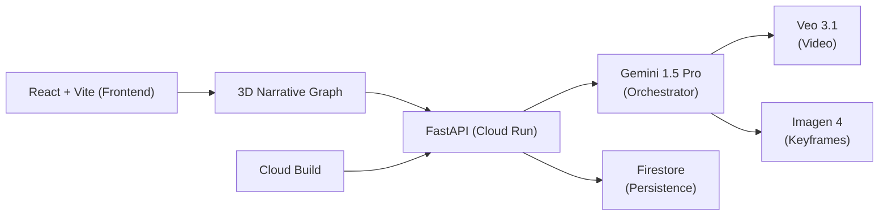

# 🎬 Vortex Previz: The Cinematic Sequence Engine

> **Winner-ready Non-Linear Pre-Visualization for the Gemini Live Agent Challenge.**

Vortex Previz is a spatial, agentic orchestration engine for filmmakers. Instead of a linear timeline, we use a **3D Narrative Graph** where concepts, subjects, and styles are nodes in a semantic void. **Gemini 1.5 Pro** acts as the Director, orchestrating **Veo 3.1** and **Imagen** in parallel to turn a messy cluster of ideas into a high-fidelity cinematic sequence in real-time.

---

## ⚡ The "God-Tier" Features

- **Spatial Ideation**: A 3D graph interface where narratives are spawned and auto-connected by a Gemini agent.
- **The Style Genome**: Extract aesthetic DNA (lighting, color, vibe) from any movie still using **Gemini 1.5 Pro Vision**.
- **Massive Orchestration**: Simultaneously directing 3+ AI models (Gemini, Veo, Imagen) to generate script, keyframes, and motion clips.
- **Multimodal Feedback**: Streamed director's commentary via **Web Speech API** that explains the "why" behind every shot.
- **Timeline Sync**: 3D nodes pulse and glow in real-time harmony with the playing video timeline.

---

## 🌐 Live Production URL
🚀 **[https://vortex-previz-app-agrics7qrq-uc.a.run.app](https://vortex-previz-app-agrics7qrq-uc.a.run.app)**  
*(Deployed on Google Cloud Run with 30-day extended trial credits)*

---

## 🖥️ Proof of Google Cloud Deployment

This project fulfills the Google Cloud requirement via **Direct API Integration** and **Automated Cloud Infrastructure**.

### ✅ Proof (1): Behind-the-Scenes Deployment
- **Cloud Run**: The entire application (Consolidated React + FastAPI) is running as a containerized service on Google Cloud Run.
- **Artifact Registry**: Images are built and managed via Google Artifact Registry.
- **Cloud Build**: Every deployment is automated via `cloudbuild.yaml`.

### ✅ Proof (2): Code-Level GCP Integration
The following files in this repository demonstrate direct use of Google Cloud services and APIs:
- **[cloudbuild.yaml](file:///c:/Users/ASHWIN%20GOYAL/OneDrive/Desktop/ideaai/knowledge-nebula/cloudbuild.yaml)**: Our automated CI/CD pipeline for Google Cloud.
- **[backend/services/omni_orchestrator.py](file:///c:/Users/ASHWIN%20GOYAL/OneDrive/Desktop/ideaai/knowledge-nebula/backend/services/omni_orchestrator.py)**: Direct orchestration of Vertex-compatible models (Veo, Imagen, Gemini).
- **[backend/services/gemini_service.py](file:///c:/Users/ASHWIN%20GOYAL/OneDrive/Desktop/ideaai/knowledge-nebula/backend/services/gemini_service.py)**: Wrapper for Google GenAI SDK and Vertex AI endpoints.
- **[backend/services/firestore_service.py](file:///c:/Users/ASHWIN%20GOYAL/OneDrive/Desktop/ideaai/knowledge-nebula/backend/services/firestore_service.py)**: Integration with Google Cloud Firestore for graph persistence.

---

## 🏗️ Architecture



---

## 🛠️ Tech Stack

- **Core**: Python (FastAPI), React, TypeScript, Three.js (3D Graph).
- **AI Models**: Gemini 1.5 Pro, Google Veo 3.1, Imagen 4.0 Fast.
- **Cloud Infra**: Google Cloud Run, Cloud Build, Artifact Registry, Firestore.
- **Real-Time**: Server-Sent Events (SSE) for multimodal streaming.

---

## 🚀 Local Setup

### 1. Backend
```bash
cd backend
python -m venv venv
# Windows
venv\Scripts\activate
# Install deps
pip install -r requirements.txt
```

### 2. Frontend
```bash
npm install
npm run dev
```

---

## 🎬 Submission Notes
- **Theme**: Creative Storyteller.
- **Challenge**: Gemini Live Agent.
- **Goal**: To move beyond Chatbots and into **Spatial Narrative Orchestration**.
